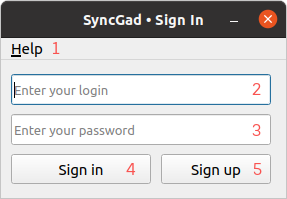
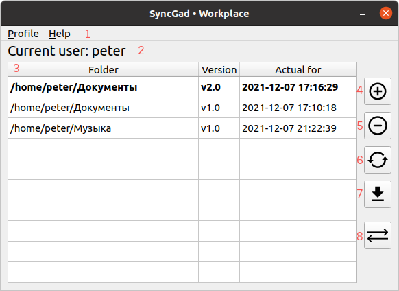

# Клиентская часть приложения SyncGad

## Оглавление

1. [Структура проекта](#структура-проекта)
2. [Назначение клиентской части](#назначение-клиентской-части)
3. [Описание экранных форм](#описание-экранных-форм)
4. [Содержимое отдельных файлов](#содержимое-отдельных-файлов)

## Структура проекта

```angular2html
Client part
        ├── connection
            ├── mailing.py                          содержит функции для отправки сообщений пользователям
            └── sockets.py                          содержит класс, обеспечивающий real-time соединение пользователей
        ├── data_processing
            ├── constants.py                        содержит константные данные такие как адрес сервера
            ├── data_validation.py                  содержит функции для проверки корректности вводимых логина, почты, пароля
            └── get_folder_data.py                  содержит функции для получения данных о выбранной пользователем папки
        ├── icons
            ├── menu                                иконки для главного меню приложения
                ├── about.svg                           иконка "о программе"
                ├── change_mail.svg                     иконка "сменить почту"
                ├── change_password.svg                 иконка "сменить пароль"
                ├── exit.svg                            иконка "выйти из приложения"
                ├── exit_profile.svg                    иконка "выйти из профиля"
                └── show_synchronized.svg               иконка "показать синхронизированные"
            ├── workplace                           иконки для кнопок на рабочем окне
                ├── add_folder.svg                      иконка "добавить папку"
                ├── delete_folder.svg                   иконка "удалить папку"
                ├── download_folder.svg                 иконка "скачать папку"
                ├── sync_folder.svg                     иконка "синхронизировать папку"
                └── update_folder.svg                   иконка "обновить папку"
        ├── images                                  изображения, используемые в README.md
            ├── images/about_window.png
            ├── images/change_mail_window.png
            ├── images/change_password_window.png
            ├── images/main_menu_help.png
            ├── images/main_menu_profile.png
            ├── images/sign_in_window.png
            ├── images/sign_up_window.png
            ├── images/to_update_window.png
            ├── images/workplace_window.png
            ├── images/wrong_sign_up.png
            ├── images/wrong_sign_up_dialog.png
            └── images/wrong_sing_in_dialog.png
        ├── UI
            ├── call_ui.py                          содержит функции вызова диалоговых окон
            ├── create_menu.py                      содержит функции инициализации главного меню
            ├── ui_about.py                         содержит класс формы "о программе"
            ├── ui_accept_synchronize.py            содержит класс формы "принять запрос на синхронизацию"
            ├── ui_change_email.py                  содержит класс формы "сменить почту"
            ├── ui_change_password.py               содержит класс формы "сменить пароль"
            ├── ui_sign_in.py                       содержит класс формы "авторизация"
            ├── ui_sign_up.py                       содержит класс формы "регистрация"
            ├── ui_synchronized.py                  содержит класс формы "список синхронизированных"
            ├── ui_to_update.py                     содержит класс формы "список необновленных актуальных"
            ├── ui_verification_code.py             содержит класс формы "ввод кода верификации"
            └── ui_workplace.py                     содержит класс формы "рабочее окно"
        ├── UI_functional
            ├── change_personal_data.py             содержит функции, необходимые для работы окна "сменить почту" и "сменить пароль"
            ├── sign_in.py                          содержит функции, необходимые для работы окна "авторизация"
            ├── sign_out.py                         содержит функции, необходимые для работы окна "регистрация"
            ├── synchronized.py                     содержит функции, необходимые для работы окна "список синхрониированных"
            └── workplace.py                        содержит функции, необходимые для работы окна "рабочее окно"
        ├── main.py                                 является исполняемым файлом, открывающим окно авторизации
        ├── README.md
        └── requirements.txt                        содержит список всех библиотек и их версий, требующих дополнительной установки
```

## Назначение клиентской части

Разрабатываемое приложение состоит из двух частей: **клиентской** и **[серверной](https://github.com/bmstu-iu8-2021-project/psync-api)**.
Клиентская часть реализует пользовательский интерфейс, при помощи которого пользователь может пользоваться приложением, осуществляет
связь с сервером для хранения данных (текстовая информация, файлы, собранные в архивы).

## Описание экранных форм

### Главное меню
Главное меню добавлено на окно авторизации, регистрации и на рабочее окно. На первых двух оно имеет одну вкладку: 
**Help**, на третьем добавляется вкладка **Profile**.<br/>


На изображениях выше показано содержимое вкладок **Help** и **Profile**:
1. Вкладка "About" открывает окно ["о программе"](#окно-"о-программе")
2. Вкладка "Exit" закрывает приложение
3. Вкладка "Change password" открывает окно ["смена пароля"](#окно-смены-пароля)
4. Вкладка "Change mail" открывает окно ["смена почты"](#окно-смены-почты)
5. Вкладка "Delete account" открывает диалоговое окно для удаления аккаунта
6. Вкладка "Show synchronized folders" открывает окно ["список синхронизированных"](#окно-"список-синхронизированных")
7. Вкладка "Exit profile" осуществляет выход из профиля - переход на окно [авторизации](#окно-авторизации)


### Окно авторизации
Окно авторизации открывается при запуске приложения. Выглядит следующим образом:<br/>


На этом окне расположены следующие объекты:
1. [Главное меню](#главное-меню)
2. Поле ввода логина
3. Поле ввода пароля
4. Кнопка входа в профиль (если введены неверные данные, будет показано диалоговое окно)
5. Кнопка регистрации, при нажатии закрывающая это окно и открывающее окно [регистрации](#окно-регистрации)

Если пользователь введет неверный логин и/или пароль, откроется диалоговое окно<br/>


### Окно регистрации
Окно регистрации можно открыть, если в окне [авторизации](#окно-авторизации) нажать на кнопку "Sign in". Окно выглядит 
следующим образом:<br/>


На этом окне расположены следующие объекты:
1. [Главное меню](#главное-меню)
2. Поле ввода логина
3. Поле ввода почты
4. Поле ввода пароля
5. Поле повторного ввода пароля
6. Кнопка регистрации, при нажатии, если все данные введены верно, закроет это окно и откроет [рабочее](#рабочее-окно) окно

В этом окне реализована динамическая проверка вводимых данных. Если какая-то из вводимых строк не соответствует 
ожидаемому формату рядом с полем ввода будет показано соответствующее уведомление. Пример:<br/>


Когда одно из таких уведомлений на экране, продолжить регистрацию невозможно. Если все данные имеют корректный вид, но 
логин и/или почта заняты, откроется соответствующее диалоговое окно:<br/>


### Рабочее окно
В рабочее окно можно попасть после авторизации или регистрации. Оно выглядит следующим образом:</br>


На этом окне расположены следующие объекты:
1. [Главное меню](#главное-меню)
2. Текст с именем текущего пользователя
3. Таблица, отображающая все сохраненные папки пользователя (жирным выделены **актуальные** версии - содержимое их папок 
должно быть одинаковым локально и на сервере). Имеет столбцы:
   - "Folder" - абсолютный путь до сохраненной папки
   - "Version" - имя сохранения
   - "Actual for" - дата и время, на которое эта версия актуальная (дата и время загрузки этой папки)
5. Кнопка добавления нового сохранения. При нажатии открывается диалоговое окно для выбора папки
6. Кнопка удаления выбранного сохранения. При нажатии удаляет с сервера все данные о выделенной в таблице версии
7. Кнопка обновления выбранного сохранения. При нажатии обновляет выделенную в таблице версию
8. Кнопка загрузки выбранного сохранения. При нажатии скачивает выбранную в таблице версию
9. Кнопка синхронизации выбранной папки. При нажатии (если в таблице выбрана актуальная версия) открывает диалоговое 
окно для ввода имени пользователя, с которым папку нужно синхронизировать

### Окно "о программе"
Это окно можно открыть из [главного меню](#главное-меню), если выбрать "About", оно выглядит следующим образом:</br>


На окне расположен только текст с кратким описанием приложения. 

### Окно смены почты
Это окно можно открыть, если в [главном меню](#главное-меню) в разделе "Profile" выбрать пункт "Change mail".</br>


На окне расположены следующие объекты:
1. Поле ввода новой почты
2. Поле ввода пароля
3. Кнопка ввода. При нажатии и при условии, что введенная почта корректна и не занята, а пароль введен верный, почта 
пользователя будет изменена 

### Окно смены пароля
Это окно можно открыть, если в [главном меню](#главное-меню) в разделе "Profile" выбрать пункт "Change password".</br>


На окне расположены следующие объекты:
1. Поле ввода старого пароля
2. Поле нового пароля
3. Поле повторного ввода нового пароля
4. Кнопка ввода. При нажатии и при условии, что старый пароль введен верно, а новый удовлетворяет требованиям безопасности 
и был повторен верно, пароль пользователя будет изменен 

### Окно подтверждения синхронизации

### Окно "список синхронизированных"

### Окно "список необновленных актуальных"
При авторизации программа сравнивает содержимое папок актуальных версий на устройстве пользователя и на сервере. Если
хотя бы для одной из них находится различие, будет открыто это окно:</br>


На этом окне расположены следующие объекты:
1. Таблица папок, требующих обновление. Она имеет два столбца
   - Столбец с чек-боксом. Галочка в нем значит, что пользователь согласен на обновление папки
   - "Folder" - абсолютный путь до требующей обновление папки
2. Кнопка подтверждения. При нажатии все папки, помеченные галочками, будут обновлено, версии без галочек перестанут 
иметь актуальную, окно будет закрыто

Если окно будет закрыто нажатием на крестик, это будет расценено как отказ от обновления всех папок.

## Содержимое отдельных файлов
- connection/mailing.py
  - _skip_
- connection/sockets.py
  - Декоратор **separate_thread** - помещает функцию в отдельный поток и запускает его.
  - Класс **Socket** - наследуется от **QThread** 
    - Конструктор класса. Входные аргументы: логин авторизовавшегося пользователя. В конструкторе создается подключение
    серверу при помощи протокола WebSocket и инициализируется обработчик сигналов message - сигналов, говорящих о том, что сервер</br>
    вещает некоторую информацию. Такое вещание происходит, когда с текущим пользователем хочет синхронизироваться другой и отправляет
    запрос.
    - Метод **join_room**. Посылает на сервер сигнал о том, что пользователь подключился. 
    - Метод **message**. Входные аргументы: данные, присланные сервером. Обрабатывает сигналы message; если в присланных
    данных (тип данных - словарь) в поле other_user логин текущего пользователя, испускаем сигнал, в качестве аргумента 
    передает полученный с сервера словарь.
    - Метод **send_answer**. Входные аргументы: данные, которые нужно отправить на сервер. Испускает серверу сигнал send_answer
    и словарь с некоторыми данными.
    - Метод **leave_room**. Испускает сигнал о том, что пользователь вышел из системы.
- data_processing/constants.py
  - Переменная **PROTOCOL**. Содержит протокол соединения с сервером.
  - Переменная **IP**. Содержит ip сервера.
  - Переменная **PORT**. Содержит порт, по которому будет осуществляться соединение с сервером.
- data_processing/data_validation.py
  - Функция **is_login_valid**. Входные аргументы: строка, содержащая логин, который вводит пользователь. Проверяет,
  соответствует ли вводимый логин заданным параметрам. Возвращаем True или False и причину, по которой логин не подходит.
  - Функция **is_mail_valid**. Входные аргументы: строка, содержащая почту, которую вводит пользователь. Проверяет,
  соответствует ли вводимый адрес электронной почты заданным параметрам. Возвращаем True или False и причину, по 
  которой почта не подходит.
  - Функция **is_password_valid**. Входные аргументы: строка, содержащая пароль, который вводит пользователь. Проверяет,
  соответствует ли вводимый пароль заданным параметрам. Возвращаем True или False и причину, по которой пароль не подходит.
  - Функция **check_request**. Входные аргументы: объект класса requests, получаемый после отправления запроса на сервер. 
  Проверяет, является ли код входного аргумента кодом ошибки. Возвращаем True или False, создает диалоговое окно, уведомляющее
  пользователя о том, что запрос был выполнен некорректно.
- data_processing/get_folder_data.py
  - Функция **get_mac**. Возвращает строку, содержащую mac-адрес данного устройства и имя операционной системы.
  - Функция **get_files**. Входные аргументы: абсолютный путь к папке. Возвращает список абсолютных путей всех файлов
  этой папки и ее вложенные папки.
  - Функция **get_json**. Входные аргументы: список абсолютных путей всех файлов некоторой папки. Возвращает контейнер,
  содержащий словарь вида `{абсолютный путь к файлу: дата его последнего изменения, ...}`. Этот контейнер может быть приведет
  в json-формат.
- UI/call_ui.py
  - Функция **show_dialog**. Входные аргументы: строка, содержащая заголовок, строка, содержащая текст, флаг. Создает
  диалоговое окно с заданным заголовком и текстом, флаг определяет иконку: "предупреждение", "критическая ошибка" или "информация".
- UI/create_menu.py
  - Функция **du_menu**. Входные аргументы: объект класса, наследуемого от QMainWindow. Создает главное меню на заданном
  окне с вкладками "Profile" и "Help".
  - Функция **un_menu**. Входные аргументы: объект класса, наследуемого от QMainWindow. Создает главное меню на заданном
  окне с вкладкой "Help".
- UI/ui_accept_synchronize.py
  - Класс **ASWindow** - наследуется от **QMainWindow**.
    - Конструктор класса. Входные аргументы: кортеж, содержащий логин пользователя, который отправил запрос на синхронизацию
    с текущим, и его абсолютный путь до синхронизируемой папки. В конструкторе [рабочее окно](#рабочее-окно) замораживается 
    и определяется окно [подтверждения синхронизации](#окно-подтверждения-синхронизации), объекты на нем.
    - Метод **accept**. Вызывается при нажатии на кнопку "Accept". С помощью метода send_answer класса **Socket** отправляет
    на сервер сигнал о том, что пользователь принял запрос, и словарь с выбранной для синхронизации папкой, закрывает окно.
    - Метод **deny**. Вызывается при нажатии на кнопку "Deny". С помощью метода send_answer класса **Socket** отправляет
    на сервер сигнал о том, что пользователь отклонил запрос, закрывает окно.
    - Переопределенный метод **closeEvent**. [Рабочее окно](#рабочее-окно) размораживается. Если метод был вызван 
    закрытием окна, а не принятием/отклонением запроса, вызывается метод deny.
- UI/ui_change_email.py
  - Класс **CEWindow** - наследуется от **QMainWindow**.
    - Конструктор класса. Входные аргументы: логин текущего пользователя, токен. В конструкторе определяется окно
    [смены почты](#окно-смены-почты), объекты на нем.
    - Метод accept. При условии, что поля ввода непустые, вызывает функцию change_mail, которая делает попытку смены почты. 
    Если попытка удачная, окно закрывается.
- UI/ui_change_password.py
  - Класс **CPWindow** - наследуется от **QMainWindow**.
    - Конструктор класса. Входные аргументы: логин текущего пользователя, токен. В конструкторе определяется окно
    [смены пароля](#окно-смены-пароля), объекты на нем.
    - Метод accept. При условии, что поля ввода непустые и пароль повторен верно, вызывает функцию change_password, 
    которая делает попытку смены пароля. Если попытка удачная, окно закрывается.
- UI/ui_sign_in.py
  - Класс **SIWindow** - наследуется от **QMainWindow**
    - Конструктор класса. В конструкторе определяется окно [авторизации](#окно-авторизации), объекты на нем.
    - Метод **enter**. При условии, что поля ввода непустые, вызывает функцию auth, которая получает на сервере токен. 
    Если токен был получен, значит авторизация прошла успешно, окно [авторизации](#окно-авторизации) закрывается, 
    открывается [рабочее окно](#рабочее-окно). 
    - Метод **register**. Окно [авторизации](#окно-авторизации) закрывается и открывается окно [регистрации](#окно-регистрации).
    - Декорированный метод **about**. Открывается окно ["о программе"](#окно-"о-программе").
    - Декорированный метод **exit**. Программа закрывается.
    - Переопределенный метод **closeEvent**. Закрываются все окна, которые были открыты.
  - Функция **sign_in_window**. Создает окно [авторизации](#окно-авторизации) и отображает его на экране.
- UI/ui_sign_up.py
  - Класс **SUWindow** - наследуется от **QMainWindow**
    - Конструктор класса. Входные параметры: объект класса **SIWindow**. В конструкторе определяется окно 
    [регистрации](#окно-регистрации), объекты на нем.
    - Метод **is_login_valid**. Вызывается всякий раз при изменении текста в поле ввода логина. Если
    текущее содержимое поле ввода некорректно, об этом выводится уведомление.
    - Метод **is_mail_valid**. Вызывается всякий раз при изменении текста в поле ввода электронной почты. Если
    текущее содержимое поле ввода некорректно, об этом выводится уведомление.
    - Метод **is_password_valid**. Вызывается всякий раз при изменении текста в поле ввода пароля. Если
    текущее содержимое поле ввода некорректно, об этом выводится уведомление.
    - Метод **are_passwords_same**. Вызывается всякий раз при изменении текста в поле повторного ввода пароля. Если
    текущее содержимое поле ввода некорректно, об этом выводится уведомление.
    - Метод **fix_size**. Проверяет, остались ли на окне уведомления о неправильном вводе. Если нет, сжимает окно до
    исходного размера.
    - Метод **accept**. При условии, что уведомлений о неправильном вводе нет на окне и поля ввода непустые, вызывает 
    функцию accept, которая делает попытку зарегистрировать пользователя. Если попытка успешная, окно 
    [регистрации](#окно-регистрации) закрывается и открывается [рабочее окно](#рабочее-окно), иначе создается диалоговое
    окно с описанием проблемы.
    - Декорированный метод **about**. Открывается окно ["о программе"](#окно-"о-программе").
    - Декорированный метод **exit**. Программа закрывается.
    - Переопределенный метод **closeEvent**. Закрывает все открытые окна и открывает окно [авторизации](#окно-авторизации).
- UI/ui_synchronized.py
  - Класс **SWindow** - наследуется от **QMainWindow**
    - Конструктор класса. Входные параметры