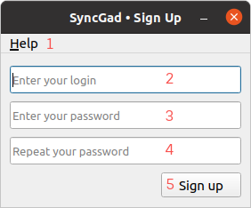
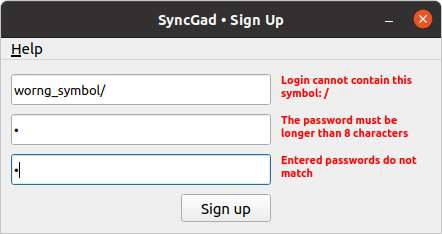
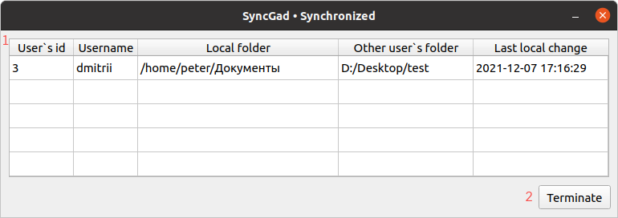
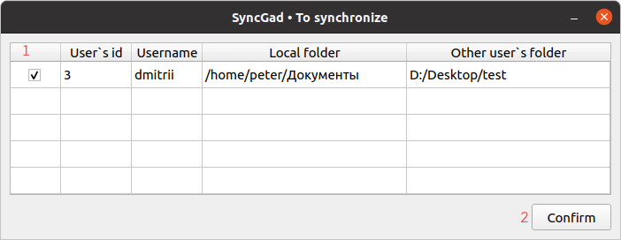

# Клиентская часть приложения SyncGad

## Оглавление

1. [Структура проекта](#структура-проекта)
2. [Назначение клиентской части](#назначение-клиентской-части)
3. [Описание экранных форм](#описание-экранных-форм)
4. [Содержимое отдельных файлов](#содержимое-отдельных-файлов)

## Структура проекта

```angular2html
Client part
        ├── connection
            └── sockets.py                          содержит класс, обеспечивающий соединение с сервером по протоколу WebSocket
        ├── data_processing
            ├── constants.py                        содержит константные данные, используемые в большинстве модулей
            ├── data_validation.py                  содержит функции для проверки корректности некоторых вводимых данных
            └── get_folder_data.py                  содержит функции для получения данных о выбранной пользователем папки
        ├── icons
            ├── menu                                иконки для главного меню приложения
                ├── about.svg                          
                ├── change_password.svg                
                ├── delete_account.svg                 
                ├── exit.svg                           
                ├── exit_profile.svg                   
                └── show_synchronized.svg               
            ├── workplace                           иконки для кнопок на рабочем окне
                ├── add_folder.svg                      
                ├── delete_folder.svg                   
                ├── download_folder.svg                 
                ├── sync_folder.svg                     
                └── update_folder.svg                   
        ├── images                                  изображения, используемые в README.md
            ├── about_window.png
            ├── change_mail_window.png
            ├── change_password_window.png
            ├── main_menu_help.png
            ├── main_menu_profile.png
            ├── sign_in_window.png
            ├── sign_up_window.png
            ├── to_update_window.png
            ├── workplace_window.png
            ├── wrong_sign_up.png
            ├── wrong_sign_up_dialog.png
            └── wrong_sing_in_dialog.png
        ├── UI
            ├── call_ui.py                          содержит функции вызова диалоговых окон
            ├── create_menu.py                      содержит функции инициализации главного меню
            ├── ui_about.py                         содержит класс формы "о программе"
            ├── ui_accept_synchronize.py            содержит класс формы "принять запрос о синхронизации"
            ├── ui_change_password.py               содержит класс формы "сменить пароль"
            ├── ui_sign_in.py                       содержит класс формы "авторизация"
            ├── ui_sign_up.py                       содержит класс формы "регистрация"
            ├── ui_synchronized.py                  содержит класс формы "список синхронизированных"
            ├── ui_to_update.py                     содержит класс формы "список необновленных актуальных"
            └── ui_workplace.py                     содержит класс формы "рабочее окно"
        ├── UI_functional
            ├── change_password.py                  содержит функции, используемые классом формы "сменить пароль"
            ├── sign_in.py                          содержит функции, используемые классом формы "авторизация"
            ├── sign_up.py                          содержит функции, используемые классом формы "регистрация"
            ├── synchronized.py                     содержит функции, используемые классом формы "список синхрониированных"
            └── workplace.py                        содержит функции, используемые классом формы "рабочее окно"
        ├── main.py                                 является исполняемым файлом, открывающим окно авторизации
        ├── README.md
        └── requirements.txt                        содержит список всех библиотек и их версий, требующих дополнительной установки
```

## Назначение клиентской части

Разрабатываемое приложение состоит из двух частей: **клиентской** и **[серверной](https://github.com/bmstu-iu8-2021-project/psync-api)**.
Клиентская часть реализует пользовательский интерфейс, при помощи которого пользователь может использовать приложение, осуществляет
связь с сервером для передачи на него информации (данные пользователя, сохраняемые папки).

## Описание экранных форм

### Главное меню
Главное меню добавлено на окно авторизации, регистрации и на рабочее окно. На первых двух оно имеет одну вкладку: 
**Help**, на третьем добавляется вкладка **Profile**.<br/>

 - РЕДАКТИРОВАТЬ 

На изображениях выше показано содержимое вкладок **Help** и **Profile**:
1. Вкладка "About" открывает окно ["о программе"](#окно-"о-программе")
2. Вкладка "Exit" закрывает приложение
3. Вкладка "Change password" открывает окно ["смена пароля"](#окно-смены-пароля)
4. Вкладка "Delete account" открывает диалоговое окно для удаления аккаунта
5. Вкладка "Show synchronized folders" открывает окно ["список синхронизированных"](#окно-"список-синхронизированных")
6. Вкладка "Exit profile" осуществляет выход из профиля - переход на окно [авторизации](#окно-авторизации)


### Окно авторизации
Окно авторизации открывается при запуске приложения. Выглядит следующим образом:<br/>
 - РЕДАКТИРОВАТЬ

На этом окне расположены следующие объекты:
1. [Главное меню](#главное-меню)
2. Поле ввода логина
3. Поле ввода пароля
4. Кнопка входа в профиль (если введены неверные данные, будет показано диалоговое окно)
5. Кнопка регистрации. При нажатии закрывающая это окно и открывающее окно [регистрации](#окно-регистрации)

Если пользователь введет неверный логин и/или пароль, откроется диалоговое окно<br/>


### Окно регистрации
Окно регистрации можно открыть, если в окне [авторизации](#окно-авторизации) нажать на кнопку "Sign in". Окно выглядит 
следующим образом:<br/>
 - РЕДАКТИРОВАТЬ

На этом окне расположены следующие объекты:
1. [Главное меню](#главное-меню)
2. Поле ввода логина
3. Поле ввода пароля
4. Поле повторного ввода пароля
5. Кнопка регистрации. При нажатии, если все данные введены верно, закроет это окно и откроет [рабочее](#рабочее-окно) окно

В этом окне реализована динамическая проверка вводимых данных. Если какая-то из вводимых строк не соответствует 
ожидаемому формату рядом с полем ввода будет показано соответствующее уведомление. Пример:<br/>
 - РЕДАКТИРОВАТЬ

Когда одно из таких уведомлений на экране, продолжить регистрацию невозможно. Если все данные имеют корректный вид, но 
логин занят, откроется соответствующее диалоговое окно:<br/>


### Рабочее окно
В рабочее окно можно попасть после авторизации или регистрации. Оно выглядит следующим образом:</br>


На этом окне расположены следующие объекты:
1. [Главное меню](#главное-меню)
2. Текст с именем текущего пользователя
3. Таблица, отображающая все сохраненные папки пользователя (жирным выделены **актуальные** версии - содержимое их папок 
должно быть одинаковым локально и на сервере). Имеет столбцы:
   - "Folder" - абсолютный путь до сохраненной папки
   - "Version" - имя сохранения
   - "Actual for" - дата и время, на которое эта версия актуальная (дата и время загрузки этой папки)
5. Кнопка добавления нового сохранения. При нажатии открывается диалоговое окно для выбора папки
6. Кнопка удаления выбранного сохранения. При нажатии удаляет с сервера все данные о выделенной в таблице версии
7. Кнопка обновления выбранного сохранения. При нажатии обновляет выделенную в таблице версию
8. Кнопка загрузки выбранного сохранения. При нажатии скачивает выбранную в таблице версию
9. Кнопка синхронизации выбранной папки. При нажатии (если в таблице выбрана актуальная версия) открывает диалоговое 
окно для ввода имени пользователя, с которым папку нужно синхронизировать

### Окно "о программе"
Это окно можно открыть из [главного меню](#главное-меню), если выбрать "About", оно выглядит следующим образом:</br>


На окне расположен текст с кратким описанием приложения.

### Окно смены пароля
Это окно можно открыть, если в [главном меню](#главное-меню) в разделе "Profile" выбрать пункт "Change password".</br>


На окне расположены следующие объекты:
1. Поле ввода старого пароля
2. Поле нового пароля
3. Поле повторного ввода нового пароля
4. Кнопка ввода. При нажатии и при условии, что старый пароль введен верно, а новый удовлетворяет требованиям безопасности 
и был повторен верно, пароль пользователя будет изменен 

### Окно подтверждения синхронизации
Это окно открывается, когда пользователю, находящемуся на [рабочем](#рабочее-окно) окне, приходит запрос на синхронизацию.
Оно выглядит следующим образом:</br>


На окне расположены следующие объекты:
1. Текстовое поле с логином пользователя, отправившего запрос
2. Текстовое поле с абсолютным путем до синхронизируемой папки другого пользователя на его устройстве
3. Выпадающий список, в котором перечислены все актуальные папки данного пользователя
4. Кнопка "Accept". При нажатии сервер сохраняет в базу данных, что папка, выбранная в выпадающем списке, и отображаемая
в текстовом поле, должны быть синхронизированы.
5. Кнопка "Deny". При нажатии запрос на синхронизацию отклоняется.

Закрытие окна равносильно нажатию "Deny". О любом выборе пользователя будет уведомлен отправивший запрос.</br>
Если у пользователя нет актуальный папок, выпадающий список будет пустой, а кнопка "Accept" неактивной.

### Окно "список синхронизированных"
Это окно можно открыть из [главного меню](#главное-меню), если выбрать "Show synchronized", оно выглядит следующим образом:</br>


На окне расположены следующие объекты:
1. Таблица, отображающая все синхронизации пользователя. Она имеет столбцы:
   - "Username" - логин пользователя, с которым данная синхронизация
   - "Local folder" - абсолютный путь до синхронизируемой папки на устройстве пользователя
   - "Other user`s folder" - абсолютный путь до синхронизируемой папке на устройстве другого пользователя 
   - "Last local change" - дата и время последнего локального изменения синхронизируемой папки
2. Кнопка разрыва связи. При нажатии выбранная в таблице пара синхронизированных папок перестает синхронизироваться</br></br>

Это же окно может само открыться после авторизации пользователя, если синхронизируемые папки имеют разное содержимое.
Оно будет выглядеть следующим образом:


На нем расположены
1. Таблица с информацией обо всех папках, требующих синхронизации. Она имеет следующие столбцы:
   - Столбец с чек-боксами. Галочка означает, что пользователь согласен на синхронизацию папки
   - "Username" - логин пользователя, с которым данная синхронизация
   - "Local folder" - абсолютный путь до синхронизируемой папки на устройстве пользователя
   - "Other user`s folder" - абсолютный путь до синхронизируемой папке на устройстве другого пользователя 
2. Кнопка "Confirm". При нажатии выбранные папки синхронизируются. Для остальных связь разрывается.

Если окно будет закрыто нажатием на крестик, это будет расценено как отказ от синхронизации всех папок.

### Окно "список необновленных актуальных"
При авторизации программа сравнивает содержимое папок актуальных версий на устройстве пользователя и на сервере. Если
хотя бы для одной из них находится различие, будет открыто это окно:</br>


На этом окне расположены следующие объекты:
1. Таблица папок, требующих обновление. Она имеет два столбца
   - Столбец с чек-боксом. Галочка в нем значит, что пользователь согласен на обновление папки
   - "Folder" - абсолютный путь до требующей обновление папки
2. Кнопка подтверждения. При нажатии все папки, помеченные галочками, будут обновлено, версии без галочек перестанут 
иметь актуальную, окно будет закрыто

Если окно будет закрыто нажатием на крестик, это будет расценено как отказ от обновления всех папок.

## Содержимое отдельных файлов
- connection/sockets.py
  - Декоратор **separate_thread** - помещает функцию в отдельный поток и запускает его.
  - Класс **Socket** - наследуется от **QThread** 
    - Конструктор класса. Входные аргументы: логин авторизовавшегося пользователя. В конструкторе создается подключение
    серверу при помощи протокола WebSocket и инициализируется обработчик сигналов message - сигналов, говорящих о том, что сервер</br>
    вещает некоторую информацию. Такое вещание происходит, когда с текущим пользователем хочет синхронизироваться другой.
    - Метод **join_room**. Посылает на сервер сигнал о том, что пользователь авторизовался. 
    - Метод **message**. Входные аргументы: данные, присланные сервером. Обрабатывает сигналы message; если в присланных
    данных (тип данных - словарь) в поле receiver_login логин текущего пользователя, испускаем сигнал, который будет</br>
    обработан классом рабочего окна в качестве аргумента передает полученный с сервера словарь.
    - Метод **send_answer**. Входные аргументы: данные, которые нужно отправить на сервер. Посылает на сервер сигнал
    send_answer и словарь с некоторыми данными.
    - Метод **leave_room**. Посылает на сервер сигнал о том, что пользователь вышел из своего аккаунта.
- data_processing/constants.py
  - Переменная **PROTOCOL**. Содержит протокол соединения с сервером.
  - Переменная **IP**. Содержит ip сервера.
  - Переменная **PORT**. Содержит порт, по которому будет осуществляться соединение с сервером.
- data_processing/data_validation.py
  - Функция **is_login_valid**. Входные аргументы: строка, содержащая логин, который вводит пользователь. Проверяет,
  соответствует ли логин заданным параметрам. Возвращает True или False и причину, по которой логин не подходит.
  - Функция **is_password_valid**. Входные аргументы: строка, содержащая пароль, который вводит пользователь. Проверяет,
  соответствует ли пароль заданным параметрам. Возвращает True или False и причину, по которой пароль не подходит.
  - Функция **is_version_valid**. Входные аргументы - имя сохраняемой версии, которое ввел пользователь. Проверяет,
  соответствует ли имя версии заданным параметрам. Возвращает True или False и причину, по которой имя версии не подходит.
  - Функция **check_request**. Входные аргументы: объект класса requests, получаемый после отправления запроса на сервер. 
  Проверяет, является ли код входного аргумента кодом ошибки. Возвращаем True или False, создает диалоговое окно, уведомляющее
  пользователя о том, что запрос был выполнен некорректно.
- data_processing/get_folder_data.py
  - Функция **get_mac**. Возвращает строку, содержащую mac-адрес данного устройства и имя операционной системы.
  - Функция **get_files**. Входные аргументы: абсолютный путь к папке. Возвращает список абсолютных путей всех файлов
  дерева данной директории.
  - Функция **get_json**. Входные аргументы: список абсолютных путей всех файлов некоторой папки. Возвращает контейнер,
  содержащий словарь вида `{абсолютный путь к файлу: дата его последнего изменения, ...}`. Этот контейнер может быть приведен
  в json-формат.
- UI/call_ui.py
  - Функция **show_dialog**. Входные аргументы: строка, содержащая заголовок; строка, содержащая текст; флаг. Создает
  диалоговое окно с заданным заголовком и текстом, флаг определяет иконку: "предупреждение", "критическая ошибка" или "информация".
  - Функция **show_verification_dialog**. Входные аргументы: строка, содержащая заголовок и строка, содержащая текст. Создает
  диалоговое окно с кнопками "Да" и "Нет", заданным заголовком и текстом. Возвращает True иил False в зависимости от того,
  что выбрал пользователь.
- UI/create_menu.py
  - Функция **du_menu**. Входные аргументы: объект класса, наследуемого от QMainWindow. Создает главное меню на заданном
  окне с вкладками "Profile" и "Help".
  - Функция **un_menu**. Входные аргументы: объект класса, наследуемого от QMainWindow. Создает главное меню на заданном
  окне с вкладкой "Help".
- UI/ui_about.py
  - Класс **AWindow** - наследуется от **QMainWindow**.
    - Конструктор класса. В конструкторе определяется окно ["о программе"](#окно-"о-программе"), объекты на нем.
- UI/ui_accept_synchronize.py
  - Класс **ASWindow** - наследуется от **QMainWindow**.
    - Конструктор класса. Входные аргументы: кортеж, содержащий логин пользователя, который отправил запрос на синхронизацию
    с текущим, и его абсолютный путь до синхронизируемой папки. В конструкторе [рабочее окно](#рабочее-окно) замораживается 
    и определяется окно [подтверждения синхронизации](#окно-подтверждения-синхронизации), объекты на нем.
    - Метод **accept**. Вызывается при нажатии на кнопку "Accept". С помощью метода send_answer класса **Socket** отправляет
    на сервер сигнал о том, что пользователь принял запрос, и словарь с выбранной для синхронизации папкой, закрывает окно.
    - Метод **deny**. Вызывается при нажатии на кнопку "Deny". С помощью метода send_answer класса **Socket** отправляет
    на сервер сигнал о том, что пользователь отклонил запрос, закрывает окно.
    - Переопределенный метод **closeEvent**. [Рабочее окно](#рабочее-окно) размораживается. Если метод был вызван 
    закрытием окна, а не принятием/отклонением запроса, вызывается метод deny.
- UI/ui_change_password.py
  - Класс **CPWindow** - наследуется от **QMainWindow**.
    - Конструктор класса. Входные аргументы: логин текущего пользователя, токен. В конструкторе определяется окно
    [смены пароля](#окно-смены-пароля), объекты на нем.
    - Метод accept. При условии, что поля ввода непустые и пароль повторен верно, вызывает функцию change_password, 
    которая делает попытку смены пароля. Если попытка удачная, окно закрывается.
- UI/ui_sign_in.py
  - Класс **SIWindow** - наследуется от **QMainWindow**
    - Конструктор класса. В конструкторе определяется окно [авторизации](#окно-авторизации), объекты на нем.
    - Метод **enter**. При условии, что поля ввода непустые, вызывает функцию auth, которая получает на сервере токен. 
    Если токен был получен, значит авторизация прошла успешно, окно [авторизации](#окно-авторизации) закрывается, 
    открывается [рабочее окно](#рабочее-окно). 
    - Метод **register**. Окно [авторизации](#окно-авторизации) закрывается и открывается окно [регистрации](#окно-регистрации).
    - Декорированный метод **about**. Открывает окно ["о программе"](#окно-"о-программе").
    - Декорированный метод **exit**. Завершает работу программы.
    - Переопределенный метод **closeEvent**. Закрываются все окна, которые были открыты.
  - Функция **sign_in_window**. Создает окно [авторизации](#окно-авторизации) и отображает его на экране.
- UI/ui_sign_up.py
  - Класс **SUWindow** - наследуется от **QMainWindow**.
    - Конструктор класса. Входные параметры: объект класса **SIWindow**. В конструкторе определяется окно 
    [регистрации](#окно-регистрации), объекты на нем.
    - Метод **is_login_valid**. Вызывается всякий раз при изменении текста в поле ввода логина. Если
    текущее содержимое поле ввода некорректно, об этом выводится уведомление.
    - Метод **is_mail_valid**. Вызывается всякий раз при изменении текста в поле ввода электронной почты. Если
    текущее содержимое поле ввода некорректно, об этом выводится уведомление.
    - Метод **is_password_valid**. Вызывается всякий раз при изменении текста в поле ввода пароля. Если
    текущее содержимое поле ввода некорректно, об этом выводится уведомление.
    - Метод **are_passwords_same**. Вызывается всякий раз при изменении текста в поле повторного ввода пароля. Если
    текущее содержимое поле ввода некорректно, об этом выводится уведомление.
    - Метод **fix_size**. Проверяет, остались ли на окне уведомления о неправильном вводе. Если нет, сжимает окно до
    исходного размера.
    - Метод **accept**. При условии, что уведомлений о неправильном вводе нет на окне и поля ввода непустые, вызывает 
    функцию accept, которая делает попытку зарегистрировать пользователя. Если попытка успешная, окно 
    [регистрации](#окно-регистрации) закрывается и открывается [рабочее окно](#рабочее-окно), иначе создается диалоговое
    окно с описанием проблемы.
    - Декорированный метод **about**. Открывает окно ["о программе"](#окно-"о-программе").
    - Декорированный метод **exit**. Завершает работу программы.
    - Переопределенный метод **closeEvent**. Закрывает все открытые окна и открывает окно [авторизации](#окно-авторизации).
- UI/ui_synchronized.py
  - Класс **SWindow** - наследуется от **QMainWindow**.
    - Конструктор класса. Входные параметры: режим окна ("static", "update"), json с данными, которые нужно отобразить 
    в таблице, объект класса **WPWindow**. В конструкторе [рабочее окно](#рабочее-окно) замораживается, определяется окно
    ["список синхронизированных"](#окно-"список-синхронизированных"), объекты на нем в зависимости от выбранного режима окна.
    - Метод **create_static_table**. Создает на окне таблицу для отображения существующих синхронизаций.
    - Метод **fill_static_table**. Заполняет таблицу существующих синхронизаций значениями из заданного json.
    - Метод **create_update_table**. Создает на окне таблицу для отображения папок, которые требуют синхронизации.
    - Метод **fill_update_table**. Заполняет таблицу требующих синхронизацию папок значениями из заданного json.
    - Метод **confirm**. Вызывается при нажатии на кнопку "Confirm". Синхронизирует выбранные папки, с остальными связь
    разрывается. Закрывает окно.
    - Метод **terminate_sync**. Вызывается при нажатии на кнопку "Terminate". Вызывает метод terminate_sync, разрывающий
    выбранную в таблице синхронизацию, обновляет таблицу.
    - Переопределенный метод **closeEvent**. В режиме окна "update", если оно закрыто нажатием на крестик, разрывает все
    приведенные в таблице связи. [Рабочее окно](#рабочее-окно) размораживается.
- UI/ui_to_update.py
  - Класс **TUWindow** - наследуется от **QMainWindow**.
    - Конструктор класса. Входные параметры: json с данными, которые нужно отобразить в таблице, объект класса **WPWindow**. 
    В конструкторе [рабочее окно](#рабочее-окно) замораживается, определяется окно 
    ["список необновленных актуальных"](#окно-"список-необновленных-актуальных"), объекты на нем.
    - Метод **create_table**. Создает на окне таблицу для отображения списка папок, требующих обновления.
    - Метод **fill_table**. Заполняет таблицу данными из заданного json.
    - Метод **confirm**. Вызывается при нажатии на кнопку подтверждения. Обновляет все выбранные папки, остальные перестают
    быть актуальными.
    - Переопределенный метод **closeEvent**. Если окно было закрыто нажатием на крестик, все приведенные папки перестают
    быть актуальными. [Рабочее окно](#рабочее-окно) размораживается.
- UI/ui_verification_code.py
  - _skip_
- UI/ui_workplace.py
  - Класс **WPWindow** - наследуется от **QMainWindow**.
    - Конструктор класса. Входные параметры: логин текущего пользователя, токен, объект класса **SIWindow**. В конструкторе 
    определяется [рабочее окно](#рабочее-окно), объекты на нем. Устанавливается соединение с сервером по протоколу WebSocket.
    - Метод **create_table**. Создает на окне таблицу для отображения всех добавленный версий.
    - Метод **fill_table**. Заполняет таблицу значениями из полученного с сервера json.
    - Метод **check_actuality**. Проверяет, есть ли разница между содержимым папки актуальной версии на устройстве и на
    сервере. Если разница находится, создается объект класса **TUWindow**.
    - Метод **check_synchronized**. Проверяет, есть ли на сервере разница между синхронизированными папками. Если
    разница находится, создается объект класса **SWindow**.
    - Метод **add_folder**. Вызывается при нажатии на кнопку добавления нового сохранения. Создает диалоговое окно, в
    котором пользователь выбирает папку. Вызывается метод add_folder, отправляющий данные на сервер. Таблица обновляется.
    - Метод **delete_version**. Вызывается при нажатии на кнопку удаления версии. Удаляет с сервера все данные
    выбранной версии. Обновляет таблицу.
    - Метод **update_version**. Вызывается при нажатии на кнопку обновления версии. Отправляет на сервер текущую версию
    выбранной папки. Обновляет таблицу.
    - Метод **download_version**. Вызывается при нажатии на кнопку загрузки сохранения. Скачивает выбранную версию на место
    имеющейся. Выбранная версия становится актуальной.
    - Метод **synchronize**. Вызывается при нажатии на кнопку синхронизации. При условии, что выбранная версия является
    актуальной, отправляет запрос на синхронизацию указанному пользователю.
    - Метод **make_actual**. Вызывается при двойном нажатии на непустую строку в таблице. Делает выбранную версию актуальной. 
    При необходимости обновляет ее. Обновляет таблицу.
    - Метод **notifications**. Обрабатывает сигналы, посланные этому классу. В зависимости от типа сигнала, указанного в
    данных, переданных вместе с ним, создает диалоговое окно или объект класса **ASWindow** и уведомляет пользователя.
    - Декорированный метод **change_password**. Открывает окно ["смена пароля"](#окно-смены-пароля).
    - Декорированный метод **delete_account**. Создает диалоговое окно для подтверждения действий пользователя.
    - Метод **delete_dialog_action**. Обрабатывает нажатие на кнопку в диалоговом окне, созданным методом delete_account.
    - Декорированный метод **show_synchronized**. Открывает окно ["список синхронизированных"](#окно-"список-синхронизированных").
    - Декорированный метод **exit_profile**. Закрывает [рабочее окно](#рабочее-окно) и открывает окно 
    [авторизации](#окно-авторизации).
    - Декорированный метод **about**. Открывает окно ["о программе"](#окно-"о-программе").
    - Декорированный метод **exit**. Завершает работу программы.
    - Метод **closeEvent**. Разрывается соединение с сервером, закрывает все открытые окна, открывает окно 
    [авторизации](#окно-авторизации).
- UI_functional/change_personal_data.py
  - Функция **change_mail**. Входные параметры: логин текущего пользователя, новая почта, пароль, токен. При условии, что 
  подан верный пароль, совершается http-запрос на сервер, в результате которого в базе данных обновляется почта пользователя.
  - Функция **change_password**. Входные параметры: логин текущего пользователя, текущий пароль, новый пароль, токен. При
  условии, что подан верный текущий пароль, совершается http-запрос на сервер, в результате которого в базе данных
  обновляется пароль пользователя.
- UI_functional/sign_in.py
  - Функция **auth**. Входные параметры: логин и пароль пользователя, который авторизуется. Совершается http-запрос на сервер,
  в результате которого устанавливается, существует ли пользователь с таким логином и паролем. Если существует, на сервере
  создается токен и возвращается клиенту.
- UI_functional/sign_up.py
  - Функция **register**. Входные параметры: логин, почта, пароль пользователя. При помощи http-запросов на сервер проверяется,
  свободны ли эти логин и почта. Если свободны, то данные пользователя вносятся в базу данных и клиент получает токен.
- UI_functional/synchronized.py
  - Функция **terminate_sync**. Входные параметры: логин, синхронизируемая папка текущего пользователя, другого пользователя, токен. 
  Совершает http-запрос на сервер, в результате которого синхронизация данных папок между данными пользователями разрывается.
  - Функция **synchronize_folder**. Входные параметры: логин, синхронизируемая папка текущего пользователя, другого пользователя, токен. 
  Совершает http-запрос на сервер, в результате которого данных папки данных пользователей будут синхронизированы.
- UI_functional/workplace.py
  - Функция **get_folders**. Входные параметры: логин текущего пользователя, токен. Совершает http-запрос на сервер и получает
  все сохраненные версии пользователя, записанные в json.
  - Функция **check_actuality**. Входные параметры: логин текущего пользователя, содержимое некоторой папки в json, токен. 
  Совершает http-запрос на сервер, где сравнивается локальное содержимое папки и содержимое, хранимое на сервере. Возвращается
  json с данными папок, содержимое которых различается.
  - Функция **make_no_actual**. Входные параметры: логин текущего пользователя, абсолютный путь к сохраненной папке, токен. 
  Совершает http-запрос на сервер, где все версии этой папки становятся неактуальными.
  - Функция **update_actual_folder**. Входные параметры: логин текущего пользователя, абсолютный путь к сохраненной папке. 
  Вызывает функцию update_version для актуальной версии данной папки.
  - Функция **check_synchronized**. Входные параметры: логин текущего пользователя, токен. Отправляет http-запрос на
  сервер, в результате проверяется, одинаково ли содержание синхронизированных папок на сервере. Если для какой-то папки
  текущего пользователя есть расхождение, возвращается json с данными этих папок.
  - Функция **add_version**. Входные параметры: логин текущего пользователя, абсолютный путь к сохраняемой папке, имя
  версии, токен. При условии, что для данной папки данное имя версии не занято, вызывает функцию upload_folder для
  заданных параметров, совершает http-запрос на сервер, в результате которого все данные помещаются в базу данных.
  - Функция **upload_folder**. Входные параметры: логин текущего пользователя, абсолютный путь к сохраняемой папке, имя
  версии, токен. Архивирует заданную папку и отправляет архив на сервер.
  - Функция **delete_version**. Входные параметры: логин текущего пользователя, абсолютный путь к сохраняемой папке, имя
  версии, токен. Отправляет http-запрос на сервер, в результате которого из базы данных удаляется информация о данной 
  версии.
  - Функция **update_version**. Входные параметры: логин текущего пользователя, абсолютный путь к сохраняемой папке, имя
  версии, токен. Вызывает функцию upload_folder для данных параметров, делает http-запрос на сервер, в результате которого
  информация о данной версии в базе данных обновится.
  - Функция **delete_user**. Входные параметры: логин текущего пользователя, токен, объект класса **WPWindow**. Создает
  диалоговое окно для ввода пароля. При условии, что он введен верно, делает http-запрос на сервер, в результате которого
  все данные указанного пользователя удаляются из базы данных.
  - Функция **download_version**. Входные параметры: логин текущего пользователя, абсолютный путь к скачиваемой
  папки, токен, версия папки, флаг. В зависимости от флага получает имя актуальной версии для данной папки или 
  использует заданное имя версии. Отправляет http-запрос на сервер, в ответ на который приходит архив с содержимым 
  указанной папки. Архив распаковывается и занимает место исходной папки.
  - Функция **synchronize**. Входные параметры: логин текущего пользователя, абсолютный путь до синхронизируемой папки, логин
  другого пользователя, токен. Совершает http-запрос на сервер, в результате которого при условии, что другой пользователь
  в сети, ему отправляется запрос на синхронизацию.  
  - Функция **make_actual**. Входные параметры: логин текущего пользователя, абсолютный путь до выбранной папки, логин
  другого пользователя, токен. Совершает http-запрос на сервер, в результате которого в базу данных записывается, что 
  для данной папки данная версия стала актуальной. Актуальность остальных версий снимается.
  - Функция **get_synchronized**. Входные параметры: логин текущего пользователя, токен. Совершает http-запрос на 
  сервер, ответом на который будет json с информацией обо всех активных синхронизациях пользователя.
- main.py
  - Точка входа в программу `if __name__ == '__main__':`. В теле условного оператора вызывается функция sign_in_window,
  открывающая окно [авторизации](#окно-авторизации).